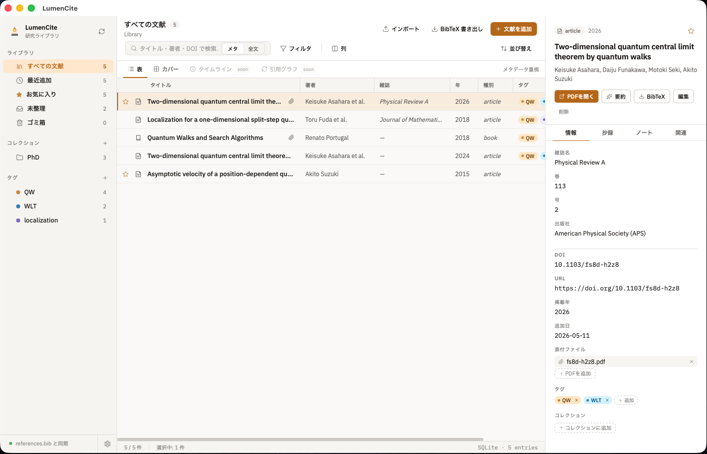
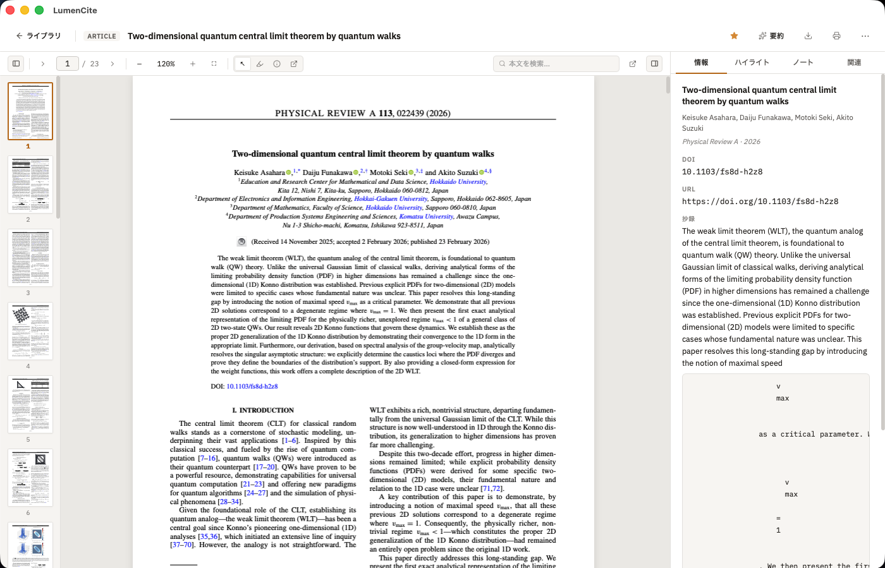

# LumenCite

[](https://github.com/sponsors/marmot1123)
[](LICENSE)

A desktop reference management application for researchers, built with **Tauri 2 + React + TypeScript**.





## Features

- 📚 **Entry management** — 論文・書籍・会議録・Webページ等の CRUD、タグ・コレクション（ネスト対応）、お気に入り、ゴミ箱
- 🔍 **Auto metadata** — DOI / arXiv / ISBN から CrossRef / arXiv API / Open Library 経由でメタデータを取得
- 📄 **PDF viewer** — pdf.js ベースの 3 ペイン詳細ビュー、3 色ハイライト、テキスト選択、ページサムネイル、印刷 (⌘P)
- ✨ **LLM summarization** — OpenAI / Anthropic 対応、API キーは OS キーチェーン保管、ストリーミング表示、カスタムシステムプロンプト
- 📐 **KaTeX** — 抄録 / ノートで `$…$` / `$$…$$` 数式レンダリング
- 🔗 **BibTeX workflow** — インポート / エクスポート + 指定パスへの自動同期 (VSCode LaTeX Workshop 連携前提)
- ⌘K **Command palette** — エントリ横断検索とグローバルアクションを一発起動
- 🌗 **i18n + theme** — 日本語 / 英語 UI、ライト / ダーク / システム追従、4 アクセントカラー
- 💾 **Backup & export** — SQLite を `VACUUM INTO` で日次自動バックアップ (14 世代保持) + JSON / BibTeX / Markdown 手動エクスポート
- ⬆️ **Auto-updater** — Tauri Updater プラグインで署名検証付きアップデート

## Download & install

最新版は [GitHub Releases](https://github.com/marmot1123/LumenCite/releases/latest) から入手できます（macOS: `.dmg` / Windows: `.msi`・`.exe` / Linux: `.AppImage`・`.deb`・`.rpm`）。macOS は署名＋notarize 済みで、アプリ内 **設定 → アップデート**から自動更新できます。

> ⚠️ **v0.1.0 をお使いの方へ:** v0.1.0 は updater 鍵の設定漏れにより**自動更新が動作しません**（「アップデートを確認」で `Invalid symbol 95, offset 7.` というエラーになります）。お手数ですが、上記 Releases から**最新版を一度だけ手動でダウンロードして入れ直して**ください。以降は自動更新が有効になります。v0.2.0 以降のバージョンはこの問題の影響を受けません。

## Requirements

- [Node.js](https://nodejs.org/) 18+ と [pnpm](https://pnpm.io/) 9+
- [Rust](https://www.rust-lang.org/tools/install) (stable toolchain)
- Tauri prerequisites: https://tauri.app/start/prerequisites/

## Development

```bash
pnpm install
pnpm tauri dev
```

Vite (port 1420) と Rust backend が連動し、ホットリロードで開発できます。

## Build

```bash
pnpm tauri build
```

`src-tauri/target/release/bundle/` 配下に各 OS 用のインストーラ (.dmg / .msi / .deb / .AppImage) が出力されます。リリース署名手順は [docs/RELEASE.md](docs/RELEASE.md) を参照してください。

## Tests

```bash
# Rust
cd src-tauri && cargo test

# Frontend (型 + ビルド)
pnpm build
```

## Documentation

- [docs/SPEC.md](docs/SPEC.md) — 機能仕様と v0.1.0 / Phase 2+ のロードマップ
- [docs/DATA_MODEL.md](docs/DATA_MODEL.md) — SQLite スキーマと設計判断
- [docs/API_SPEC.md](docs/API_SPEC.md) — Tauri コマンド一覧
- [docs/RELEASE.md](docs/RELEASE.md) — コード署名 / notarization / リリース手順

## Sponsor

LumenCite はオープンソースの個人プロジェクトです。継続的な開発を応援していただける方はぜひ [**GitHub Sponsors**](https://github.com/sponsors/marmot1123) で支援をお願いいたします。

## License

[MIT](LICENSE) © 2026 Motoki Seki and LumenCite contributors.
