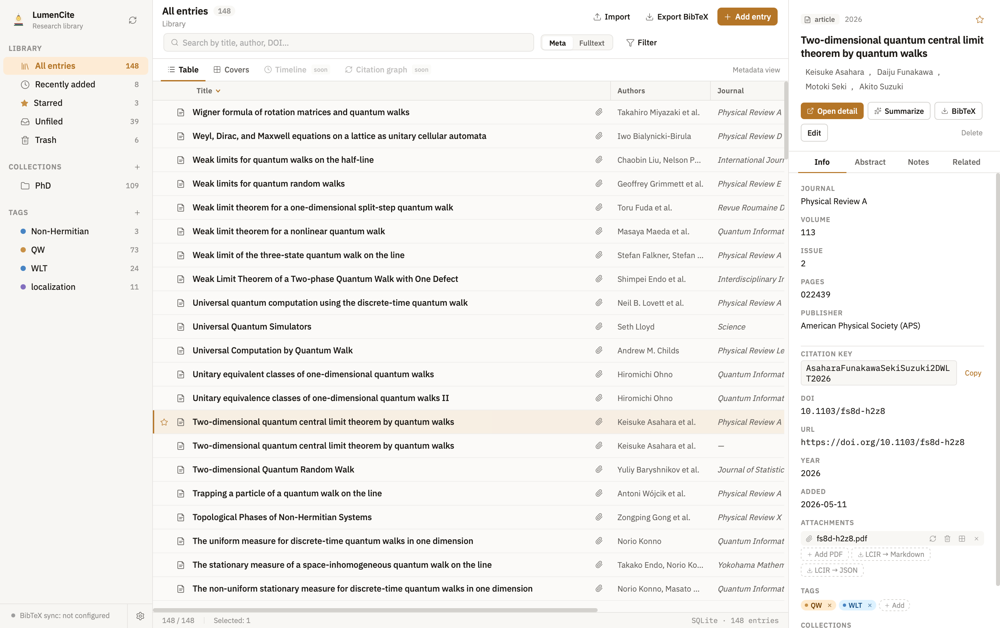
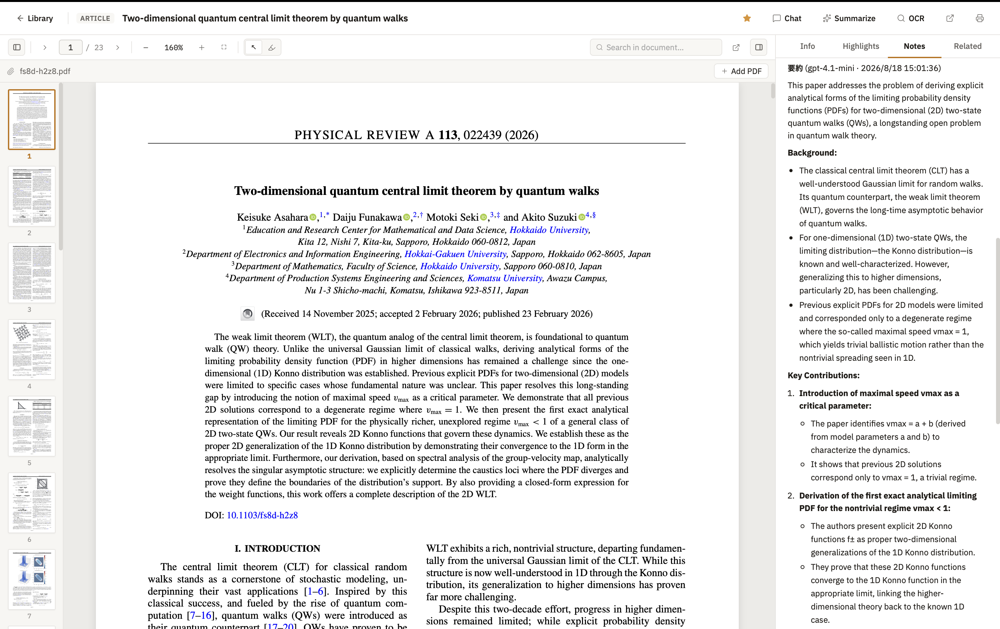

# LumenCite

[](https://github.com/sponsors/marmot1123)
[](LICENSE)

**English** | [日本語](README_ja.md)

A desktop reference management application for researchers, built with **Tauri 2 + React + TypeScript**.





## Features

- 📚 **Entry management** — create, edit, and organize 19 entry types (Zotero-compatible), with tags, nested collections, favorites, and a trash
- 🔍 **Automatic metadata** — fetch metadata from a DOI / arXiv ID / ISBN via the CrossRef, arXiv, and Open Library APIs
- 📄 **PDF viewer** — pdf.js-based three-pane detail view with 3-color highlights, text selection, page thumbnails, and printing (⌘P). Each entry can hold **multiple PDFs (the paper plus supplementary material)**, all of them full-text searchable
- 🧠 **LCIR: machine-readable paper structure** — parses PDFs and arXiv TeX sources into a tree of sections, paragraphs, theorems, proofs, definitions, equations, figures, and tables, each node carrying **provenance** (nodes parsed from the PDF also carry page coordinates). The full-text index is built from it, figures are cropped and stored, and in-text references like "Theorem 2.3" or "Figure 3" resolve to the actual nodes. **Papers are analyzed automatically when added**; an existing library fills in gradually after launch. On by default since v1.0.0
- 💬 **Agentic chat** — answers questions across your library using full-text search and LCIR read tools. Answers **distinguish the paper's own words from LumenCite's inference**, and clicking a cited block highlights the corresponding spot in the PDF
- 🔠 **Vision OCR** — transcribes scanned PDFs that have no text layer via LLM vision so they become full-text searchable. Shows progress and **can be stopped midway**; pages transcribed so far are kept
- 🔎 **Search & filters** — metadata search and PDF full-text search (FTS5), plus **compound filters** stacking entry type, year, star, attachment, and tags (AND / OR)
- 🔌 **MCP server / CLI / Web Clipper** — read and write your library from Claude Desktop, Claude Code, and Codex (localhost + Bearer token; writes are off by default), from the terminal via the built-in CLI (`lumencite bib` generates a `refs.bib`), and from the browser via the Chrome extension for one-click capture
- ✨ **LLM summarization** — OpenAI / Anthropic support, API keys stored in the OS keychain, streaming output, custom system prompts
- 📐 **KaTeX** — renders `$…$` / `$$…$$` math in abstracts and notes
- 🔗 **BibTeX workflow** — import / export plus automatic sync to a path of your choice (designed for VSCode LaTeX Workshop)
- ⌘K **Command palette** — search across entries and trigger global actions from anywhere
- 🌗 **i18n + themes** — Japanese / English UI, light / dark / system theme, 4 accent colors
- 💾 **Backup & export** — automatic backups bundle **the database and all attachment files into a single zip** (runs once 24 hours have passed since the last success, checked both at launch and periodically while the app stays open; 14 generations are kept; a manual "Back up now" always runs). Restore validates the chosen archive up front (**a corrupt archive is rejected on the spot and nothing is replaced**) and applies the swap on the next launch, before the library opens; the pre-restore state is saved automatically and comes back if anything fails midway. Manual export to JSON / BibTeX / Markdown, plus LCIR export to JSON / structured Markdown
- ⬆️ **Updates** — signed auto-updates on macOS via the Tauri Updater. **Windows / Linux get a notification only** — install new versions manually from the Releases page

## Download & install

Get the latest release from [GitHub Releases](https://github.com/marmot1123/LumenCite/releases/latest) (macOS: `.dmg` / Windows: `.msi`, `.exe` / Linux: `.AppImage`, `.deb`, `.rpm`). The macOS build is signed and notarized, and updates itself from **Settings → Updates** inside the app. The Windows build is Authenticode-signed (SmartScreen reputation builds up with downloads); the Linux build is unsigned.

> ℹ️ **For Windows / Linux users:** in-app auto-update is macOS-only. On Windows / Linux the app **only notifies you** that a new version is out — install the new installer from the Releases page yourself. **v1.0.0 is the first release to bundle the PDF parsing library (pdfium) on Windows / Linux**, so LCIR and Vision OCR work on those platforms from v1.0.0 onward.

### macOS: Homebrew

On macOS you can also install via [Homebrew](https://brew.sh/), from the self-hosted tap [marmot1123/homebrew-lumencite](https://github.com/marmot1123/homebrew-lumencite) (distributes the universal `.dmg`):

```bash
brew tap marmot1123/lumencite
brew trust marmot1123/lumencite   # required for third-party taps since Homebrew 6.0
brew install --cask lumencite
```

Update with `brew upgrade --cask lumencite`, or through the in-app auto-updater (Tauri Updater) — both work.

> ⚠️ **If you are on v0.1.0:** a missing updater key in that release means **auto-update does not work** ("Check for updates" fails with `Invalid symbol 95, offset 7.`). Please download the latest installer from the Releases page above once, manually — auto-update works from then on. v0.2.0 and later are unaffected.

## Development

Most developer docs under `docs/` are currently written in Japanese.

### Requirements

- [Node.js](https://nodejs.org/) 18+ and [pnpm](https://pnpm.io/) 9+
- [Rust](https://www.rust-lang.org/tools/install) (stable toolchain)
- Tauri prerequisites: https://tauri.app/start/prerequisites/

### Run in dev mode

```bash
pnpm install
pnpm tauri dev
```

Vite (port 1420) and the Rust backend run together with hot reload.

### Build distributables

```bash
pnpm tauri build
```

Installers for each OS (`.dmg` / `.msi` / `.deb` / `.AppImage`) are written under `src-tauri/target/release/bundle/`. For code signing and the release process, see [docs/RELEASE.md](docs/RELEASE.md).

### Tests

```bash
# Rust
cd src-tauri && cargo test

# Frontend (type check + build)
pnpm build

# Browser extension
pnpm --filter lumencite-clipper test
```

## Browser extension (Web Clipper)

LumenCite ships with a **Web Clipper** Chrome extension (Manifest V3). Open a paper page and click the toolbar button to create an entry in the running LumenCite app — it extracts DOI / arXiv / ISBN identifiers automatically, and for arXiv papers it also attaches the PDF. The extension talks to LumenCite **only over localhost on the same machine**; no external server is involved.

> ℹ️ The extension is not yet on the Chrome Web Store. For now, install manually (load unpacked) as described below. Works on Chromium-based browsers (Chrome / Edge / Brave, etc.).

### Install (for users)

1. Download `lumencite-clipper-<version>.zip` from [GitHub Releases](https://github.com/marmot1123/LumenCite/releases/latest) and **unzip it anywhere you like** (don't delete or move the unzipped folder afterwards — the extension loads directly from it).
2. Open `chrome://extensions` in Chrome and turn on **Developer mode** (top right).
3. Click **"Load unpacked"** and select the folder from step 1 (the one containing `manifest.json`).
4. Launch LumenCite, enable **Settings → Chat → Web Clipper**, and **copy the connect code** shown there.
5. Right-click the extension icon → "Options" (or `chrome://extensions` → the extension's "Details" → "Extension options") to open the options page, paste the connect code, and **save**.

You can now clip from the toolbar button on paper pages.

> 🔑 The connect code contains a secret token. If you regenerate the token in LumenCite or change the MCP server port, the pairing breaks — redo **steps 4–5** with a fresh connect code.

### Build from source (for developers)

```bash
pnpm --filter lumencite-clipper build   # generates extension/dist
```

Load `extension/dist` via `chrome://extensions` → "Load unpacked", then continue from step 4 above. The extension's version (`extension/manifest.json`) is numbered independently of the app.

## CLI

LumenCite includes a CLI for querying and editing the library from the terminal, without launching the GUI (it runs as an `argv` branch of the main binary — no extra binary is shipped). The primary use cases are **AI-agent-assisted LaTeX writing** (`\cite` keys → `refs.bib`) and shell scripting.

Output is **JSON** by default (for `jq`); `--human` switches to human-readable text. The DB path resolves automatically to Tauri's `app_data_dir` (macOS: `~/Library/Application Support/com.lumencite.app/lumencite.db`) and can be overridden with the `LUMENCITE_DB_PATH` environment variable.

### Reading

Reads open SQLite over a read-only connection (`PRAGMA query_only = ON`), so they coexist safely with a running GUI and also work while the app is closed.

```bash
# Search metadata (filters: --type / --year-min / --year-max / --starred / --has-attachment / --limit)
lumencite search "quantum walk" --year-min 2018 --limit 10

# Get a single entry (numeric id or citation key)
lumencite get smith2020a
lumencite get smith2020a --human

# Generate refs.bib from \cite keys (keys pass through verbatim; unresolved keys warn on stderr)
lumencite bib smith2020a jones2021 > refs.bib

# Bulk-export BibTeX by filter
lumencite export --type article --year-min 2020 > articles.bib

# List tags / collections, search PDF full text
lumencite tags
lumencite collections
lumencite fulltext "topological"
```

### Writing

```bash
# Create an entry (--field for type-specific fields; --author is repeatable)
lumencite add --title "My Paper" --type article --year 2026 \
  --author "Jane Doe" --citation-key doe2026a --field journal="Nature"

# Partially update an existing entry (id or citation key)
lumencite update doe2026a --year 2027 --notes "revised"

# Set notes / add a tag / add to a collection
lumencite notes doe2026a "important background reference"
lumencite tag doe2026a reading-list
lumencite collect doe2026a 3
```

Writes are routed so that an open GUI never goes stale:

- **LumenCite running (MCP server enabled)** — the CLI delegates to the app over localhost; changes show up **immediately in the entry list** and the `.bib` stays in sync (MCP writes must be allowed via "Allow write tools" under Settings → Chat → Publish as MCP server).
- **App closed** — the CLI writes directly to the DB and syncs the `.bib`.
- With `--force`, the CLI writes directly to the DB even while the app is running (open windows may show stale lists until refreshed).

> ℹ️ Destructive operations (delete), entry creation with automatic DOI / arXiv metadata fetch, and a `PATH` install story (e.g. a Homebrew `binary` symlink) are being considered for future releases.

## Documentation

Written in Japanese unless noted otherwise.

- [CHANGELOG.md](CHANGELOG.md) — release history (English)
- [docs/SPEC.md](docs/SPEC.md) — feature spec and per-version roadmap (the v1.0.0 section lists what LCIR deliberately does *not* do)
- [docs/DATA_MODEL.md](docs/DATA_MODEL.md) — SQLite schema and design decisions
- [docs/API_SPEC.md](docs/API_SPEC.md) — Tauri command reference
- [docs/RELEASE.md](docs/RELEASE.md) — code signing / notarization / release process
- [docs/LCIR_design_overview.md](docs/LCIR_design_overview.md) — LCIR design, data model, coordinate system, node types
- [docs/LCIR_REMAINING_PHASES.md](docs/LCIR_REMAINING_PHASES.md) — remaining LCIR phases, known debts, and measurements

## Sponsor

LumenCite is an open-source project developed by an individual. If you would like to support its continued development, please consider [**GitHub Sponsors**](https://github.com/sponsors/marmot1123).

## License

[MIT](LICENSE) © 2026 Motoki Seki and LumenCite contributors.
