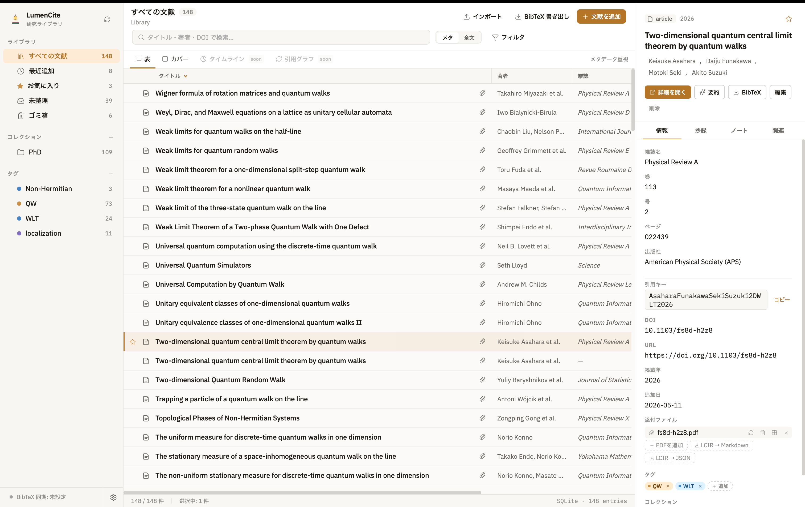
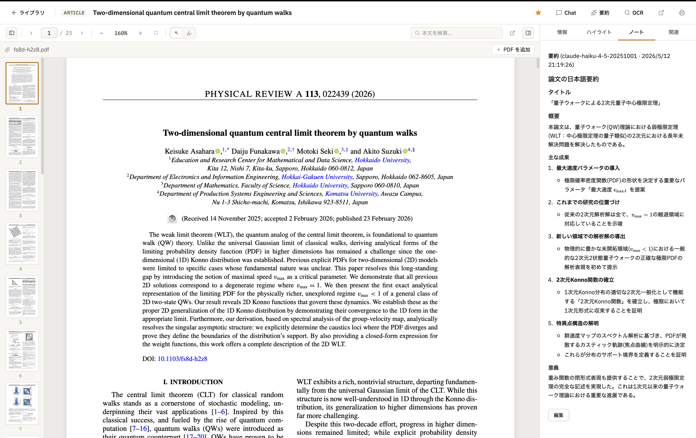

# LumenCite

[](https://github.com/sponsors/marmot1123)
[](LICENSE)

[English](README.md) | **日本語**

研究者のためのデスクトップ文献管理アプリです。
**Tauri 2 + React + TypeScript** で作られています。





## 主な機能

- 📚 **文献の管理**：19 種の文献種別（Zotero 準拠）の作成、編集、整理に対応し、タグ、コレクション（ネスト対応）、お気に入り、ゴミ箱を備えます
- 🔍 **メタデータ自動取得**：DOI / arXiv ID / ISBN から、CrossRef / arXiv / Open Library の API 経由でメタデータを取得します
- 📄 **PDF ビューア**：pdf.js ベースの 3 ペイン詳細ビュー。3 色ハイライト、テキスト選択、ページサムネイル、印刷（⌘P）に対応します。1 エントリに本文と補助資料の複数 PDF を添付でき、いずれも全文検索の対象です
- 🧠 **LCIR（論文の機械可読な構造化）**：PDF や arXiv の TeX ソースから、節、段落、定理、証明、定義、数式、図、表を、由来（provenance）つきのノード木として保存します（PDF 由来のノードはページ座標も持ちます）。全文検索の索引はここから作られ、図は切り出して保存され、本文中の「Theorem 2.3」「Figure 3」は実体へ解決されます。論文を追加すると自動で解析され、既存のライブラリは起動後に少しずつ埋まります。v1.0.0 から既定で有効です
- 💬 **エージェント型チャット**：全文検索と LCIR の読み取りツールを使い、ライブラリ横断で質問に答えます。回答では**論文自身の言葉と LumenCite の推定を区別**して示し、根拠のブロックをクリックすると PDF の該当箇所がハイライトされます
- 🔠 **Vision OCR**：テキストレイヤーのないスキャン PDF を LLM の Vision で文字起こしし、全文検索に載せます。進捗表示つきで途中で止められ、止めてもそこまでのページは残ります
- 🔎 **検索とフィルタ**：メタデータ検索と PDF 全文検索（FTS5）に加え、種別、年、スター、添付、タグ（AND / OR）を重ねられる複合フィルタを備えます
- 🔌 **MCP サーバー / CLI / Web クリッパー**：Claude Desktop / Claude Code / Codex からライブラリを読み書きできます（localhost + Bearer トークン。書き込みは既定でオフ）。ターミナルからは内蔵 CLI（`lumencite bib` で `refs.bib` を生成）、ブラウザからは Chrome 拡張でワンクリック取り込みができます
- ✨ **LLM 要約**：OpenAI / Anthropic の API に対応します。API キーは OS のキーチェーンに保管され、応答はストリーミング表示。システムプロンプトのカスタマイズもできます
- 📐 **KaTeX 数式**：抄録とノートで `$…$` / `$$…$$` の数式をレンダリングします
- 🔗 **BibTeX 連携**：インポート / エクスポートに加え、指定パスへの自動同期に対応します（VSCode LaTeX Workshop との連携を想定）
- ⌘K **コマンドパレット**：エントリ横断の検索とグローバルな操作を一発で呼び出せます
- 🌗 **多言語とテーマ**：日本語 / 英語 UI、ライト / ダーク / システム追従のテーマ、4 色のアクセントカラー
- 💾 **バックアップとエクスポート**：DB と添付ファイル本体をまとめた zip を自動バックアップします（前回の成功から 24 時間経っていれば実行。起動時と、起動したまま使い続けている間の定期チェックの両方で判定し、14 世代を保持。手動の「今すぐバックアップ」は無条件に実行）。復元は選んだアーカイブを検証してから段取りし、**壊れていればその場で弾いて何も置き換えません**。実際の差し替えはライブラリを開く前（次回起動時）に行い、差し替え前の状態は自動で退避され、途中で失敗すれば元に戻ります。JSON / BibTeX / Markdown への手動エクスポートと、LCIR の JSON / 構造付き Markdown 書き出しにも対応します
- ⬆️ **アップデート**：macOS は Tauri Updater による署名検証つき自動更新に対応します。Windows / Linux は新版の通知のみで、インストーラは Releases ページから手動で入れ替えます

## ダウンロードとインストール

最新版は [GitHub Releases](https://github.com/marmot1123/LumenCite/releases/latest) から入手できます（macOS: `.dmg` / Windows: `.msi`, `.exe` / Linux: `.AppImage`, `.deb`, `.rpm`）。
macOS 版は署名と notarization 済みで、アプリ内の「設定 → アップデート」から自動更新できます。
Windows 版は Authenticode 署名済みです（SmartScreen の評価はダウンロード実績とともに育ちます）。
Linux 版は無署名です。

> ℹ️ **Windows / Linux をお使いの方へ**：アプリ内の自動更新は macOS のみです。
> Windows / Linux では新版が出たことを知らせるところまでなので、更新は Releases ページから新しいインストーラを入れ直してください。
> v1.0.0 は Windows / Linux にとって PDF 解析ライブラリ（pdfium）の初同梱版で、LCIR と Vision OCR がこれらの OS で動くのは v1.0.0 からです。

### macOS: Homebrew

macOS では [Homebrew](https://brew.sh/) 経由でもインストールできます（自前 tap [marmot1123/homebrew-lumencite](https://github.com/marmot1123/homebrew-lumencite) から universal `.dmg` を配布）。

```bash
brew tap marmot1123/lumencite
brew trust marmot1123/lumencite   # Homebrew 6.0 以降ではサードパーティ tap に必須
brew install --cask lumencite
```

アップデートは `brew upgrade --cask lumencite` でも、アプリ内の自動更新（Tauri Updater）でも行えます。

> ⚠️ **v0.1.0 をお使いの方へ**：v0.1.0 は updater 鍵の設定漏れにより自動更新が動作しません（「アップデートを確認」が `Invalid symbol 95, offset 7.` というエラーになります）。
> お手数ですが、上記 Releases から最新版を一度だけ手動でダウンロードして入れ直してください。
> 以降は自動更新が有効になります。
> v0.2.0 以降はこの問題の影響を受けません。

## 開発

### 必要環境

- [Node.js](https://nodejs.org/) 18 以上と [pnpm](https://pnpm.io/) 9 以上
- [Rust](https://www.rust-lang.org/tools/install)（stable ツールチェーン）
- Tauri の前提条件：https://tauri.app/start/prerequisites/

### 開発モードで起動

```bash
pnpm install
pnpm tauri dev
```

Vite（ポート 1420）と Rust バックエンドが連動し、ホットリロードで開発できます。

### 配布物のビルド

```bash
pnpm tauri build
```

`src-tauri/target/release/bundle/` 配下に各 OS 用のインストーラ（`.dmg` / `.msi` / `.deb` / `.AppImage`）が出力されます。
コード署名とリリース手順は [docs/RELEASE.md](docs/RELEASE.md) を参照してください。

### テスト

```bash
# Rust
cd src-tauri && cargo test

# フロントエンド（型チェック + ビルド）
pnpm build

# ブラウザ拡張
pnpm --filter lumencite-clipper test
```

## ブラウザ拡張（Web クリッパー）

LumenCite には Chrome 拡張（Manifest V3）の **Web クリッパー**が付属します。
論文ページを開いてツールバーボタンをクリックすると、起動中の LumenCite にエントリを作成します（DOI / arXiv / ISBN を自動抽出し、arXiv は PDF も自動添付します）。
拡張と LumenCite は同じ PC 内の localhost でのみ通信し、外部サーバーは経由しません。

> ℹ️ Chrome ウェブストアでは未公開です。
> 現在は下記の手順で手動インストール（load unpacked）します。
> Chromium 系ブラウザ（Chrome / Edge / Brave など）で利用できます。

### インストール（ユーザー向け）

1. [GitHub Releases](https://github.com/marmot1123/LumenCite/releases/latest) から `lumencite-clipper-<version>.zip` をダウンロードし、任意の場所に解凍します（解凍後のフォルダは削除も移動もしないでください。拡張はそのフォルダを直接読み込みます）。
2. Chrome で `chrome://extensions` を開き、右上の「デベロッパーモード」を ON にします。
3. 「パッケージ化されていない拡張機能を読み込む」をクリックし、手順 1 で解凍したフォルダ（`manifest.json` を含むフォルダ）を選択します。
4. LumenCite を起動し、「設定 → Chat → Web クリッパー」を有効化して、表示される接続コードをコピーします。
5. 拡張のアイコンを右クリックして「オプション」（または `chrome://extensions` の拡張の「詳細」から「拡張機能のオプション」）でオプションページを開き、接続コードを貼り付けて保存します。

これで論文ページのツールバーボタンからクリップできます。

> 🔑 接続コードには秘密トークンが含まれます。
> LumenCite 側でトークンを再生成した場合や、MCP サーバーのポートを変更した場合はペアリングが切れるため、新しい接続コードで手順 4〜5 をやり直してください。

### ソースからビルド（開発者向け）

```bash
pnpm --filter lumencite-clipper build   # extension/dist を生成
```

`chrome://extensions` の「パッケージ化されていない拡張機能を読み込む」で `extension/dist` を選択すれば、上記のインストール手順 4〜5 に進めます。
拡張のバージョン（`extension/manifest.json`）はアプリと独立採番です。

## CLI（コマンドライン）

LumenCite は GUI を起動せず、ターミナルからライブラリの照会と編集ができる CLI を内蔵します（本体バイナリの `argv` 分岐で動作し、新しいバイナリは増やしていません）。
主な用途は **AI エージェントと組み合わせた LaTeX 執筆**（`\cite` キーから `refs.bib` を生成）とシェルスクリプト連携です。

出力は既定で **JSON**（`jq` 連携向け）、`--human` で人間可読テキストに切り替わります。
DB は Tauri の `app_data_dir`（macOS: `~/Library/Application Support/com.lumencite.app/lumencite.db`）を自動解決し、環境変数 `LUMENCITE_DB_PATH` で上書きできます。

### 読み取り

読み取りは SQLite を `PRAGMA query_only = ON` の読み取り専用接続で開くため、GUI アプリの起動中でも安全に共存し、停止中でも動作します。

```bash
# メタデータ検索（フィルタ: --type / --year-min / --year-max / --starred / --has-attachment / --limit）
lumencite search "quantum walk" --year-min 2018 --limit 10

# 単一エントリ（数値 id でも citation key でも可）
lumencite get smith2020a
lumencite get smith2020a --human

# \cite キー群から refs.bib を生成（キーは化けずに \cite と一致。未解決キーは stderr に警告）
lumencite bib smith2020a jones2021 > refs.bib

# フィルタ条件で BibTeX 一括エクスポート
lumencite export --type article --year-min 2020 > articles.bib

# タグ / コレクション一覧と PDF 全文検索
lumencite tags
lumencite collections
lumencite fulltext "topological"
```

### 書き込み

```bash
# エントリ作成（--field で type 固有フィールド、--author は繰り返し可）
lumencite add --title "My Paper" --type article --year 2026 \
  --author "Jane Doe" --citation-key doe2026a --field journal="Nature"

# 既存エントリの部分更新（id でも citation key でも可）
lumencite update doe2026a --year 2027 --notes "revised"

# ノート設定 / タグ付与 / コレクション追加
lumencite notes doe2026a "important background reference"
lumencite tag doe2026a reading-list
lumencite collect doe2026a 3
```

書き込みは、開いている GUI に古い表示が残らないよう、次のように振り分けられます。

- **LumenCite アプリが起動中（MCP サーバー有効）**：localhost 経由でアプリに委譲します。変更は一覧に即反映され、`.bib` も同期されます（MCP の書き込みは「設定 → Chat → MCP サーバーとして公開」の「書き込みツールを許可」を有効にする必要があります）。
- **アプリ停止中**：DB に直接書き込み、`.bib` を同期します。
- **`--force` 指定時**：アプリ起動中でも DB に直接書き込みます（開いているウィンドウの一覧は、更新するまで古い表示のままになることがあります）。

> ℹ️ 破壊的操作（削除）、DOI / arXiv からのメタデータ自動取得つき作成、CLI を PATH に載せる配布導線（Homebrew の `binary` シンボリックリンクなど）は次版以降で検討します。

## ドキュメント

- [CHANGELOG.md](CHANGELOG.md)：リリース履歴（英語）
- [docs/SPEC.md](docs/SPEC.md)：機能仕様と版ごとのロードマップ（v1.0.0 節に LCIR が「しない」ことの一覧）
- [docs/DATA_MODEL.md](docs/DATA_MODEL.md)：SQLite スキーマと設計判断
- [docs/API_SPEC.md](docs/API_SPEC.md)：Tauri コマンド一覧
- [docs/RELEASE.md](docs/RELEASE.md)：コード署名 / notarization / リリース手順
- [docs/LCIR_design_overview.md](docs/LCIR_design_overview.md)：LCIR の設計、データモデル、座標系、ノード型
- [docs/LCIR_REMAINING_PHASES.md](docs/LCIR_REMAINING_PHASES.md)：LCIR の残 Phase、積み残し債務、実測値

## スポンサー

LumenCite はオープンソースの個人プロジェクトです。
継続的な開発を応援していただける方は、ぜひ [GitHub Sponsors](https://github.com/sponsors/marmot1123) で支援をお願いします。

## ライセンス

[MIT](LICENSE) © 2026 Motoki Seki and LumenCite contributors.
